# Workshop Deutsche Börse Group

[](https://travis-ci.org/ory-am/workshop-dbg)
[](https://coveralls.io/github/ory-am/workshop-dbg?branch=master)

<!-- START doctoc generated TOC please keep comment here to allow auto update -->
<!-- DON'T EDIT THIS SECTION, INSTEAD RE-RUN doctoc TO UPDATE -->
**Table of Contents**
IT sucks

- [Prerequisites](#prerequisites)
- [Setting up your development environment](#setting-up-your-development-environment)
  - [Git](#git)
    - [Installing Git on Windows](#installing-git-on-windows)
    - [Installing Git on OSX](#installing-git-on-osx)
  - [Google's Go Language](#googles-go-language)
    - [Installing Go on Windows](#installing-go-on-windows)
    - [Installing Go on OSX](#installing-go-on-osx)
  - [JetBrains IntelliJ IDEA](#jetbrains-intellij-idea)
    - [Installing JetBrains IntelliJ IDEA on Windows](#installing-jetbrains-intellij-idea-on-windows)
    - [Installing JetBrains IntelliJ IDEA on OSX](#installing-jetbrains-intellij-idea-on-osx)
- [Wiring it all together](#wiring-it-all-together)
  - [Windows Environment](#windows-environment)
  - [Mac OSX Environment](#mac-osx-environment)
  - [IntelliJ on all platforms](#intellij-on-all-platforms)
  - [Clone this Repository](#clone-this-repository)
- [You made it!](#you-made-it)

<!-- END doctoc generated TOC please keep comment here to allow auto update -->

## Prerequisites

Every developer needs a set of tools to work with. These may vary depending on the eco system, but the following steps are
quite common amongst today's cloud developers. Before we jump into action, there are a few tools that need
to be downloaded and installed to and on your PC:

1. Download [Git](https://git-scm.com/downloads). Git works on Windows, Linux and Mac OSX.
2. Download [Google's Go Language](https://golang.org/dl/). Go works on Windows, Linux, Mac OSX, Android and other platforms.
3. Download [JetBrains IntelliJ IDEA Community Edition](https://www.jetbrains.com/idea/download/download-thanks.html?code=IIC).
   If the link provided does not work, try [this one](https://www.jetbrains.com/idea/). IntelliJ works on Windows, Linux and Mac OSX
   and is one of the most common Integrated Developer Environments (IDE) today.

While these tools are downloading, [set up an account on GitHub](https://github.com/join). You can use any email address you wish. If
you do not want to provide your personal email, you can use a "trash mailer", for example [byom.de](https://www.byom.de/).

## Setting up your development environment

### Git

Git is a Versioning Control System (VCS) developed by Linux founder Linus Torvalds and others. Git was designed because
the Linux Kernel Development got out of hand and a better VCS was needed.

#### Installing Git on Windows

Unfortunately, Microsoft *might* block the installation of Git. This is due to missing certificates, as most open source
projects do not have the resources to buy such an certificate from Microsoft. If you see an error like this one

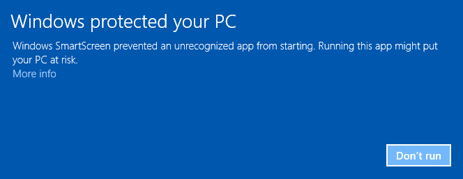

there is no need to worry. Git has been around for years and is used by hundreds of thousands of developers every day
and is completely open source and peer reviewed. To override the faulty Windows SmartScreen, click on **More info**

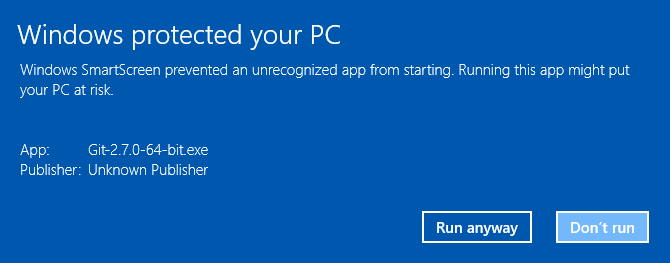

and press **Run anyway**. Now, the installer should start.

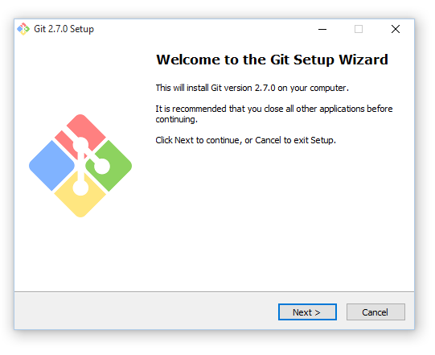

There is no need for customization while installing and you can simply use the default settings
by pressing **Next >**. When the installer is done, you should see this:

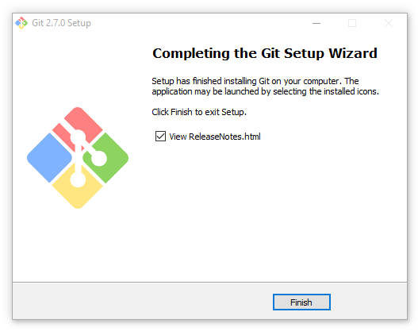

Congratulations, you have now installed the tool that every developer has on your machine. You can now skip ahead to
[Installing Go on Windows](#installing-go-on-windows).

#### Installing Git on OSX

Once you have downloaded the git installer, open the file with right-click -> open and confirm
the following dialogue:

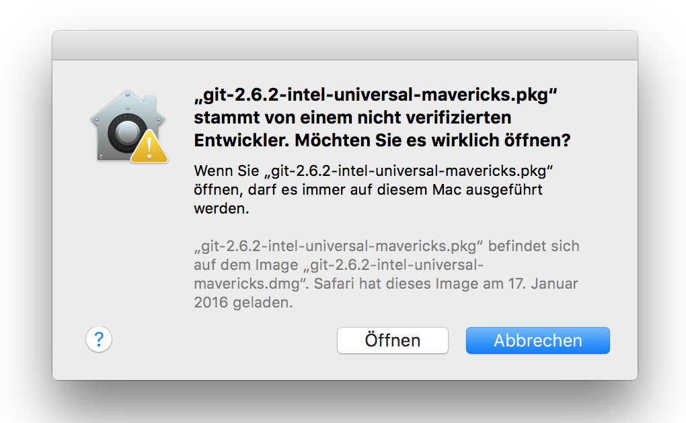

Everything else should work per default and you should end up with this screen:

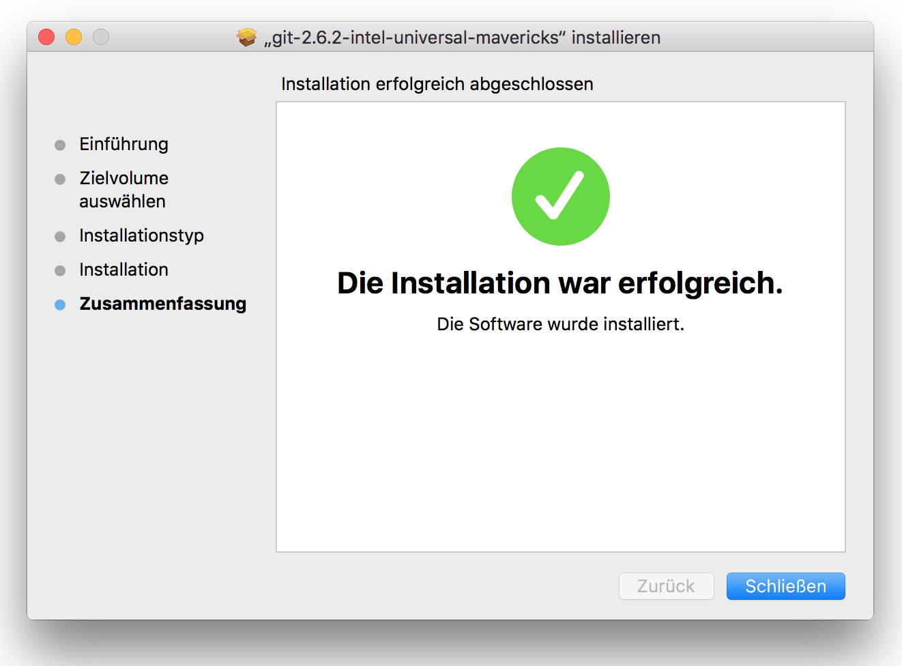

You can now skip ahead to [Installing Go on OSX](#installing-go-on-osx).

### Google's Go Language

Go is an open source programming language that makes it easy to build simple, reliable, and efficient software. It is
developed by Google and was introduced because Google had significant problems maintaining their code base.

Over time, the large scale projects at Google got significantly more complex were increasingly hard to maintain and
scale in aspects of human and computational resources. Go is therefore primarily aimed at companies that process huge
amounts of data in a large, distributed and cloud native way.

Today, six years after release, Go is the backbone of almost every modern, scalable cloud application. Companies like Amazon,
Cloudflare, Spotify or IBM, just to name a few, are using Go in their production systems. Modern infrastructure systems
like Docker, Cloud Foundry or Kubernetes are written primarily in Go.

#### Installing Go on Windows

Installing Go on Windows is straight forward. You can leave all defaults as-is. Once Go is installed, you should
see a screen similar to this one:

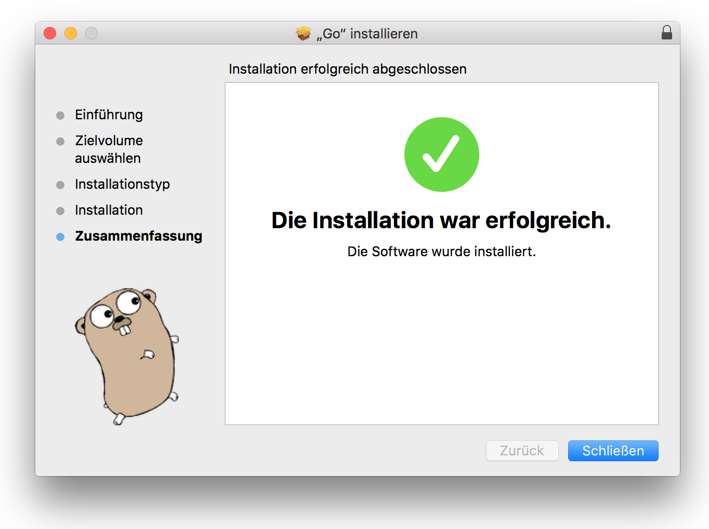

You can now skip ahead to [Installing JetBrains IntelliJ IDEA on Windows](#installing-jetbrains-intellij-idea-on-windows).

#### Installing Go on OSX

Installing Go on OSX is straight forward. You can leave all defaults as-is. Once Go is installed, you should
see a screen similar to this one:


You can now skip ahead to [Installing JetBrains IntelliJ IDEA on OSX](#installing-jetbrains-intellij-idea-on-osx).

### JetBrains IntelliJ IDEA

JetBrains IntelliJ IDEA is an IDE aimed at Java developers. JetBrains has various IDEs for all sorts of programming
languages including Ruby, JavaScript, PHP and others. IntelliJ is my personal favorite and has superb support for Google
Go.

#### Installing JetBrains IntelliJ IDEA on Windows

The set up is straight forward. You can leave all defaults as-is. Once Go is installed, you should see a screen similar to this one:

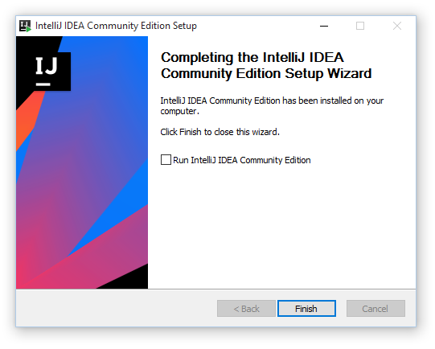

You can now skip ahead to [Windows Environment](#windows-environment).

#### Installing JetBrains IntelliJ IDEA on OSX

The set up is straight forward. You can leave all defaults as-is. Once Go is installed, you should see a screen similar to this one:

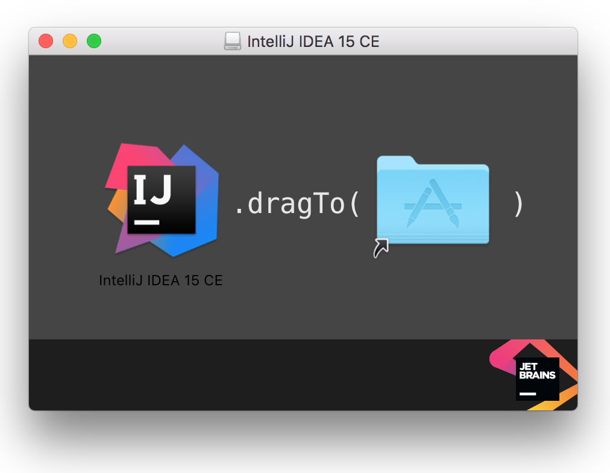

## Wiring it all together

The hardest part is wiring it all together because each environment (your PC) is unique in it's configuration. There
are a couple of things that need to be done now.

### Windows Environment

There are a few things we need to do on Windows to get things running. First, we need to set up your workspace.
To do so, create a `workspace` directory anywhere on your disk. I keep mine in my home directory at
`C:\Users\aeneas\workspace`. Because we are working with go, it is a good idea to create a subdirectory called `go` as
well `C:\Users\aeneas\workspace\go`.

Now we need to tell Go where this directory is by setting up an environment variable. Open the Windows start menu,
search for "environment variables" and click on "Edit the system environment variables":

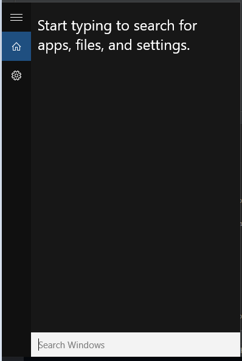

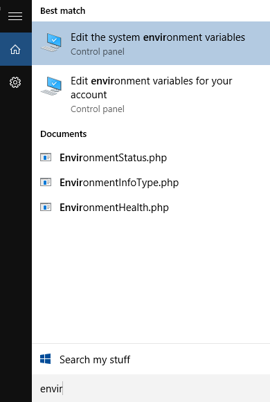

Next, click on "Environment Variables" and then on "New" in the "System variables" section:

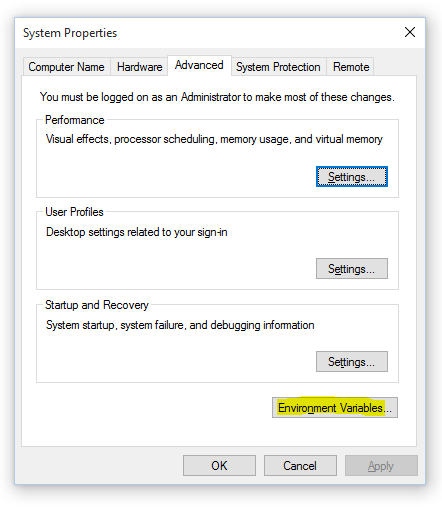

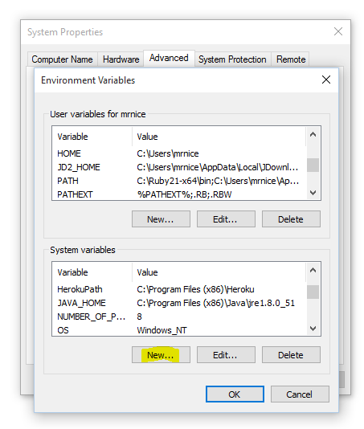

Now we will set the GOPATH by using `GOPATH` as "Variable name" and the path to your go workspace as "Variable value":

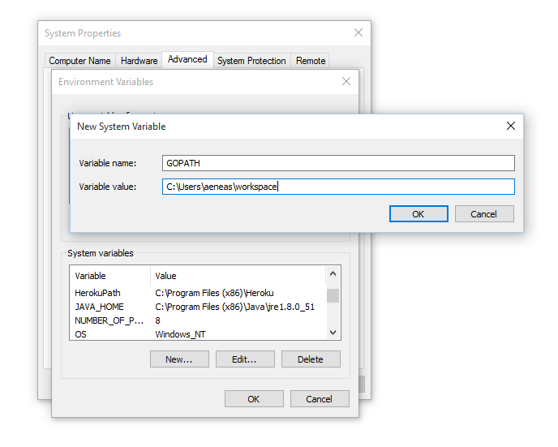

Congratulations! You just completed setting up Go! Next we will initialize IntelliJ and once that is done, we are ready
to run and modify some code!

### Mac OSX Environment

There are a few things we need to do on OSX to get things running. First, open
the terminal. To do so, open the terminal by using spotlight or launchpad search

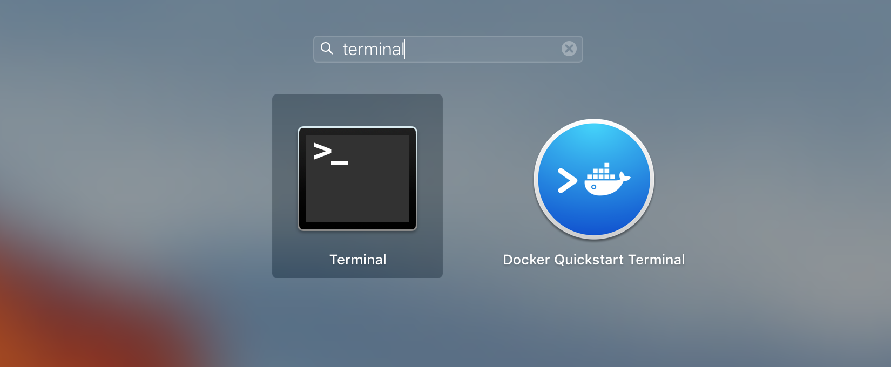

When using developer tools on OSX, Apple forces to use the so called XCode Tools
which require an Apple account and are 2 GB large. Because only git is needed, we are going
to to a little hack by typing:

```
echo "PATH=/usr/local/git/bin:\$PATH" >> ~/.bash_profile
source ~/.bash_profile
```

in the console. You can use **copy and paste** in the OSX terminal.
To verify that git is set up properly, type `git` in the console. You should see
something like:

```
usage: git [--version] [--help] [-C <path>] [-c name=value]
           [--exec-path[=<path>]] [--html-path] [--man-path] [--info-path]
           [-p | --paginate | --no-pager] [--no-replace-objects] [--bare]
           [--git-dir=<path>] [--work-tree=<path>] [--namespace=<name>]
           <command> [<args>]

...
```

Now let's set up your workspace.
To do so, create a `workspace` directory anywhere on your disk. I keep mine in my home directory at
`/Users/aeneas/workspace`. Because we are working with go, it is a good idea to create a subdirectory called `go` as
well `/Users/aeneas/workspace/go`. OSX has very good terminal support and we can create
a workspace in your home directory directly from commandline.

```
mkdir -p ~/workspace/go
```

Now we need to tell Go where your workspace is located. To do so, type

```
echo "GOPATH=~/workspace/go" >> ~/.bash_profile
source ~/.bash_profile
```

If you used a different directory for your workspace, you need to replace `~/workspace/go`
with your directory path.

### IntelliJ on all platforms

Next, we need to set up IntelliJ and Go. The following screens should guide you through the process

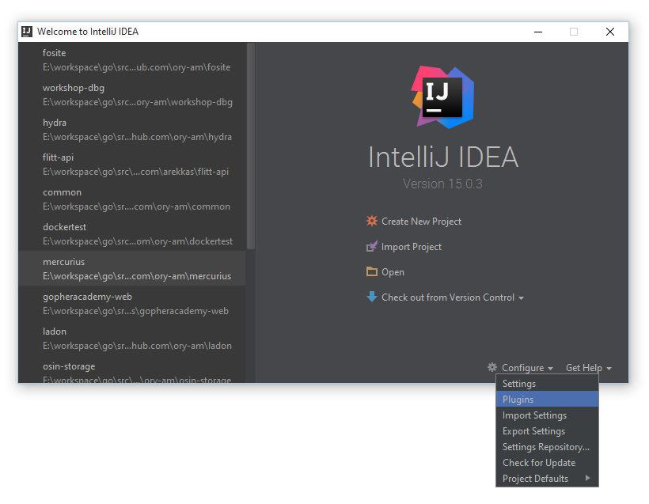

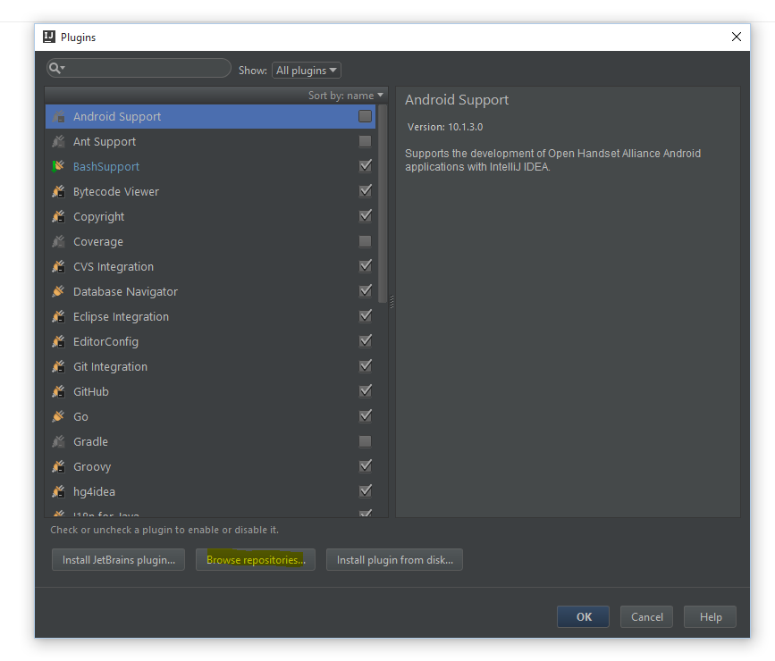

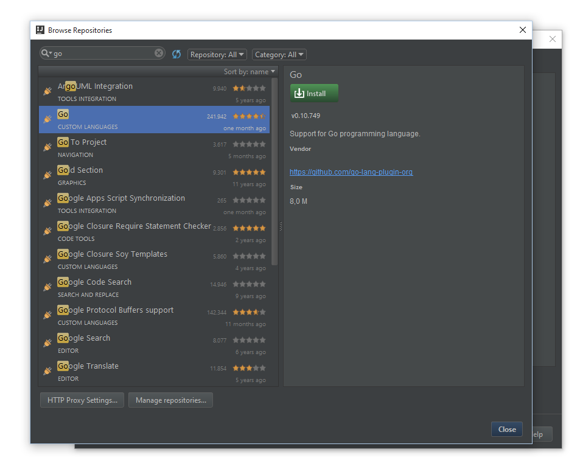

Now hit install and "Restart IntelliJ" once the set up has completed.

### Clone this Repository

We are going to make modification to this repository. To do so, we need to check out this repository. Do you remember
where you created your workspace at? We are to clone this repository into that directory. Open IntelliJ, click on *Checkout
from version control*

The following screens should be similar to what you see on your screen:

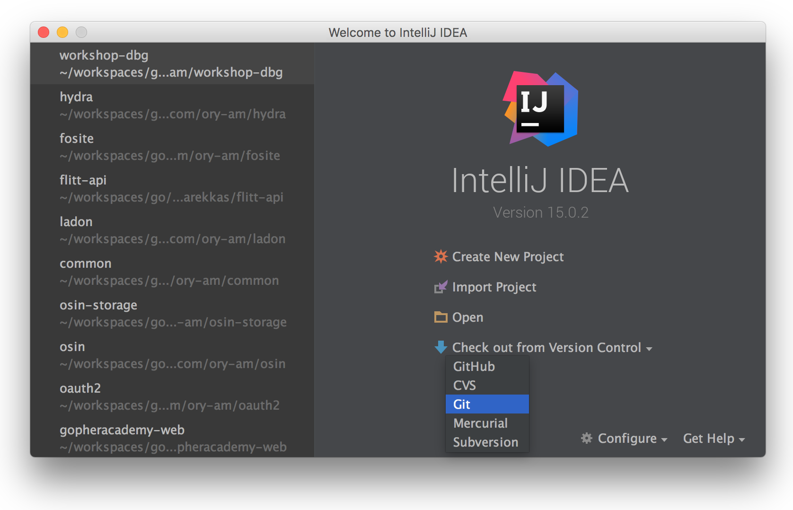

use this link as repository url `https://github.com/ory-am/workshop-dbg.git` and your workspace directory (e.g. `/Users/aeneas/workspace/go`)
as parent directory.

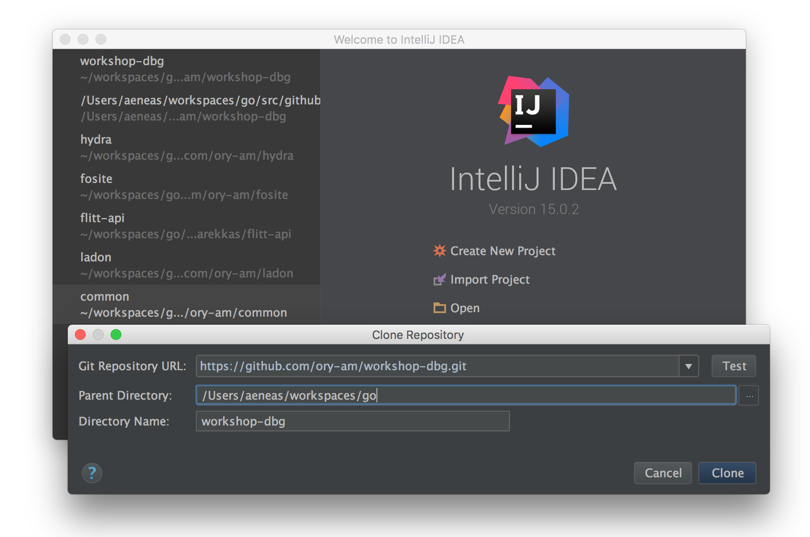

You will now see some screens which you can confirm as-is until you get to this one:

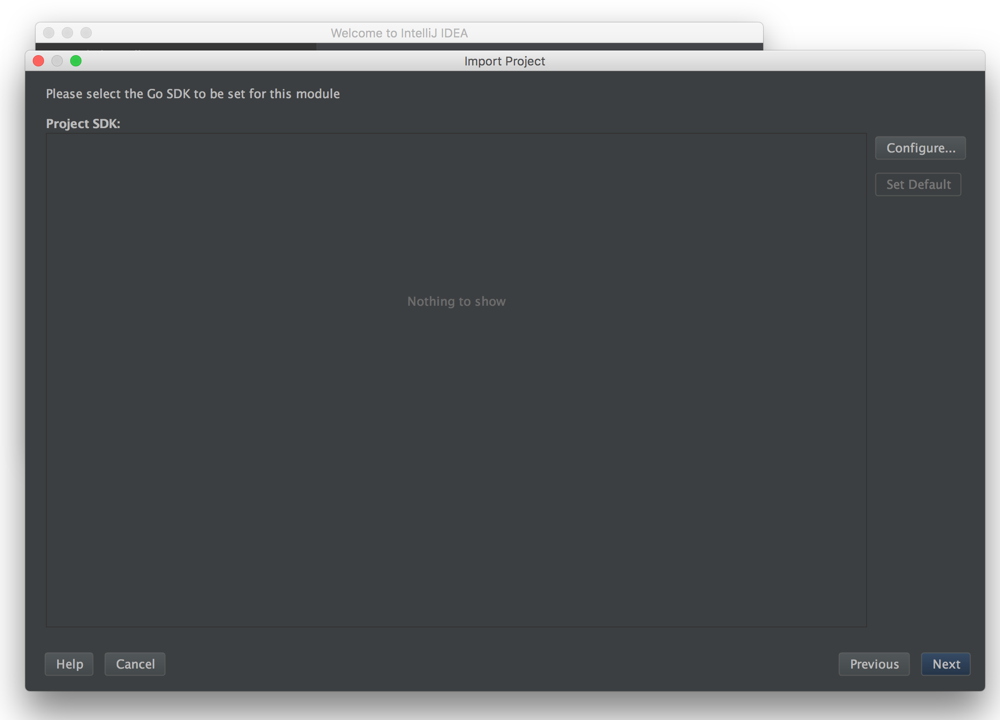

IntelliJ now asks us to set up a software development kit (SDK). We are going to do so by clicking *configure* and
choosing the location where Go is installed. This should be detected automatically. If not, it will be located in
`C:\Go` on windows and in `/usr/local/go` on mac:


Once you have confirmed this dialogue as well and confirmed with *Finish*, you should end up with a screen similar to this one:

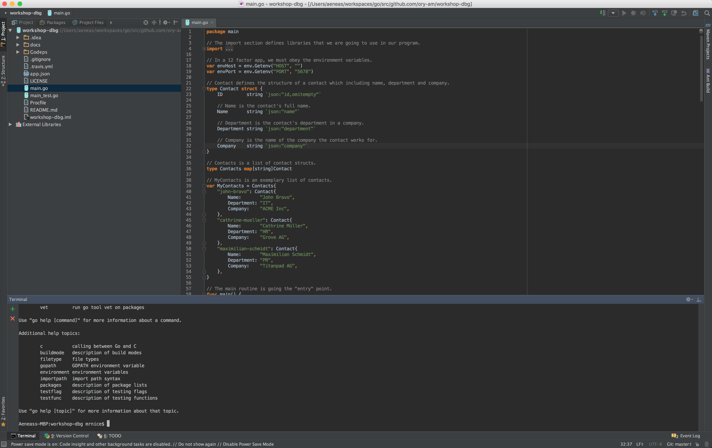

## You made it!

Congratulations! You mastered one of the trickiest parts modern developers face: setting up your development environment.
We are now going to look at some code and collaborative improve our application, deploy it to the cloud, review it and much more.
